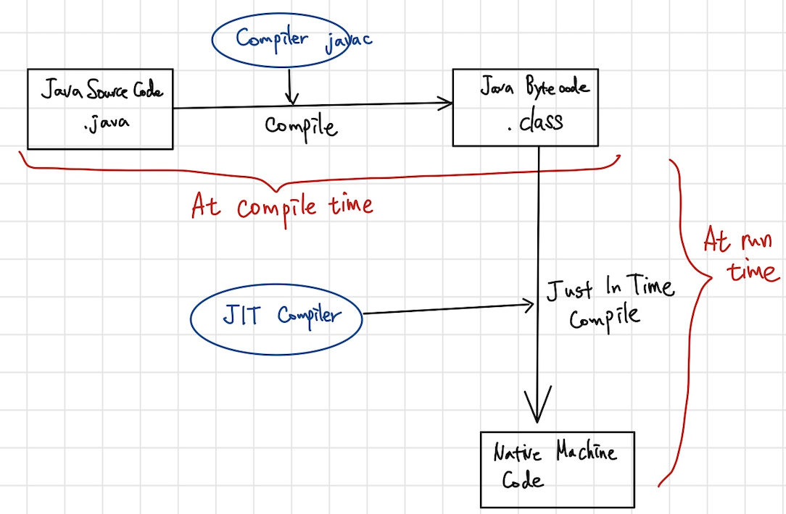
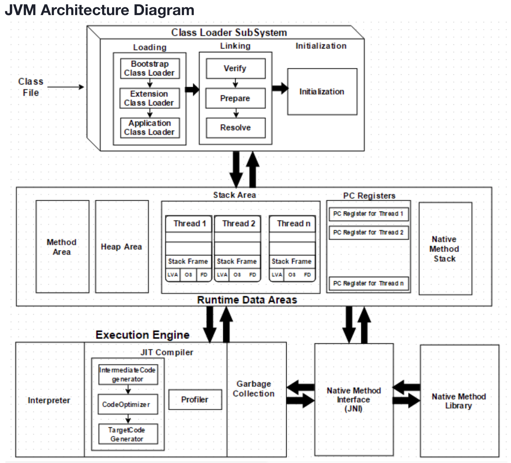
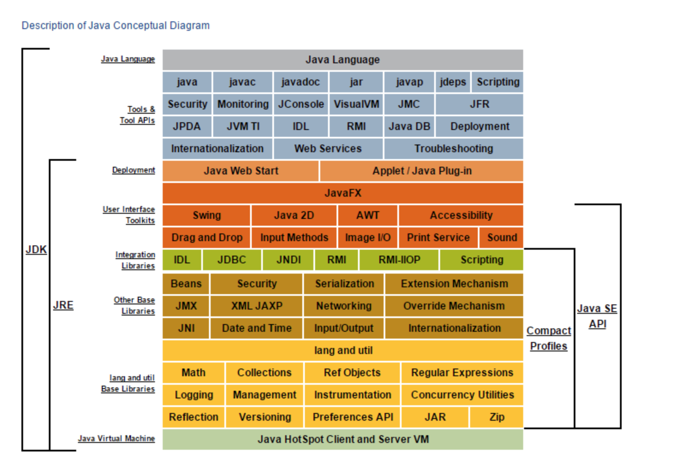

# 1주차: JVM은 무엇이며 자바 코드는 어떻게 실행하는 것인가
백기선님이 여신 [스터디 할래](https://github.com/whiteship/live-study)에 참여합니다.

## JVM이란 무엇인가
- 자바 가상 머신 (Java Virtual Machine)
- Java 애플리케이션을 실행하기 위한 런타임 환경을 제공하는 엔진
- Java 바이트코드를 기계어로 변환
- Java Run Environment(JRE)의 한 부분

## 컴파일 하는 방법
- Java 프로그램 컴파일은 보통 `.java` 파일을 `.class` 파일로 변환하는 것을 말한다.
- Java 컴파일로는 javac, Jikes, ECJ, JIT 등이 있다. (예시는 javac 사용)
``` java
// HelloWorld.java
public class HelloWorld {
    public static void main(String[] args) {
        System.out.println("Hello World!");
    }
}
```
``` shell
$ javac HelloWorld.java
$ ls
HelloWorld.class HelloWorld.java
```

## 실행하는 방법
``` shell
$ java HelloWorld
Hello World!
```

## 바이트코드란 무엇인가
- Java 바이트코드란 JVM의 instruction set이다.
    - [Java bytecode instruction 리스트](https://en.wikipedia.org/wiki/Java_bytecode_instruction_listings)
- platform-neutral 하기 때문에 Java의 중요한 컨셉인 `Write Once Run Everywhere`를 가능하게 한다. 

## JIT 컴파일러란 무엇이며 어떻게 동작하는지
- Just-In-Time 컴파일을 함
- 동적 번역(dynamic translation)이라고도 하며 Java 바이트 코드를 런타임에 기계어로 번역하는 컴파일 기법이다. 
- 인터프리터와 컴파일의 짬뽕이라고 이해하면 쉽다
- JRE에 속한다.

### JIT 동작 방법

다른 일반적인 방식처럼 프로그램이 실행되기 전에 모든 코드를 기계어로 컴파일하지 않고, 런타임에 Java 바이트코드를 기계어로 컴파일하기 때문에 속도가 빠르다. JIT 컴파일러가 사용되는 예로는 Java의 JVM과 C#의 CLR(Common Language Runtime)가 있다.

## JVM 구성 요소

그림과 내용 출처: https://dzone.com/articles/jvm-architecture-explained

JVM은 크게 3개의 하부시스템으로 나눠진다.
1. ClassLoader Subsystem
    - input으로 들어온 Class 파일을 load, link, 초기화(initialize)한다.
2. Runtime Data Area
    - Method Area, Heap Area, Stack Area, PC Registers, Native Method stacks로 구성된다.
3. Execution Engine
    - Runtime Data Area에 할당된 바이트코드를 실행한다.
    - Interpreter, JIT Compiler가 있는데 바이트코드를 기계로 변활 할 때 둘을 함께 사용한다.
    - Garbage Collector는 참조되고 있지 않은 object를 찾아 메모리를 해제한다.
- 나머지로는 Java Native Interface (JNI), Native Method Libraries 등이 있다.

## JDK와 JRE의 차이
- JDK (Java Developement Kit), JRE (Java Runtime Environment)

출처: https://c10106.tistory.com/3135

- 그림에서 알 수 있듯이 JDK가 JRE를 포함하며, JRE가 JVM을 포함한다.
- JRE는 Java 프로그램 실행을 위한 라이브러리를 포함하고 JDK는 개발을 위해 필요한 javac, java를 포함한다.

### 참고
- https://ko.wikipedia.org/wiki/JIT_%EC%BB%B4%ED%8C%8C%EC%9D%BC
- https://aboullaite.me/understanding-jit-compiler-just-in-time-compiler/